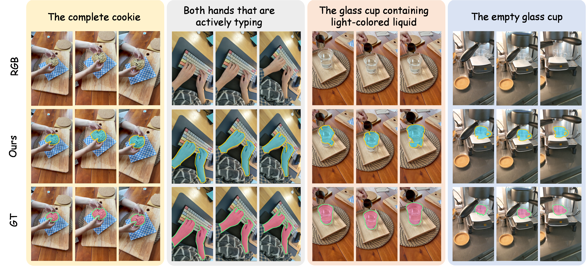
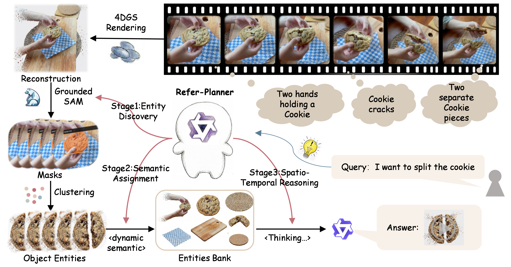

# R4DGS: Referring Segmentation in 4D Gaussian Splatting

<div align="center">

[](LICENSE)
[](#quick-start)
[](#citation)

[Project Page](https://trump0412.github.io/R4DGS/) | [Paper](https://doi.org/10.1145/3767308.3836021) | [R4D-Bench-QA](https://huggingface.co/datasets/LiYacheng/r4d-bench-qa) | [Citation](#citation)

**Bangpu Chen, Yaxuan Li, Shirui Peng, Xiangtian Si, Liuxin Chu, Xitong Cao, Hongbo Jin, Jiayu Ding**

</div>

ReferGaussian performs natural-language referring segmentation in dynamic 4D Gaussian scenes. It uses a Qwen-based Refer-Planner, Grounded-SAM2 masks, and training-free multi-frame Gaussian entity lifting over a frozen standard 4DGS scene. The final masks are rendered from the selected Gaussian entity.

<p align="center">
  
</p>

## Method

<p align="center">
  
</p>

ReferGaussian first grounds language into tracked multi-frame masks, lifts their consistent spatial evidence into Gaussian entities, stores them in EntityBank, and reasons over entity identity and temporal state. Stage-1 masks supervise entity assignment and boundary gating; they never replace the final Gaussian-rendered prediction.

## Results

Paper results are shown below. See [metrics](docs/METRICS.md) for the frozen executable definitions and [reproduction status](docs/REPRODUCTION_STATUS.md) for the distinction between paper-reported and released dense protocols.

| Benchmark | Method | Acc | vIoU |
|---|---|---:|---:|
| R4D-Bench-QA | Segment then Splat | 55.6 | 28.4 |
| R4D-Bench-QA | 4D LangSplat | 58.4 | 32.1 |
| R4D-Bench-QA | **ReferGaussian** | **76.5** | **34.4** |
| 4D LangSplat HyperNeRF, 4 scenes | 4D LangSplat | 90.83 | **72.26** |
| 4D LangSplat HyperNeRF, 4 scenes | **ReferGaussian** | **93.01** | 62.95 |

## Quick Start

Requirements: Linux, Miniconda, CUDA 12.1, and COLMAP for preparing HyperNeRF point clouds.

### 1. Setup

```bash
git clone https://github.com/Trump0412/R4DGS.git
cd R4DGS
bash scripts/setup.sh
source scripts/common.sh
```

`setup.sh` checks out pinned, unmodified [4DGaussians](https://github.com/hustvl/4DGaussians) and [Grounded-SAM-2](https://github.com/IDEA-Research/Grounded-SAM-2) revisions and creates separate 4DGS and query environments.

### 2. Data

Keep datasets and runs outside the repository if desired:

```bash
export GS_DATA_ROOT=/absolute/path/to/refergaussian-data
export GS_RUN_ROOT=/absolute/path/to/refergaussian-runs
source scripts/common.sh

# Dynamic annotations and the R4D-Bench-QA dense release.
bash scripts/download_4dlangsplat_annotations.sh
bash scripts/download_r4d_bench_qa.sh

# Seven HyperNeRF scenes used by the two released protocols.
bash scripts/prepare_hypernerf.sh
```

R4D-Bench also uses the Neural 3D Video scenes `coffee_martini`, `cook_spinach`, `cut_roasted_beef`, `flame_salmon_1`, `flame_steak`, and `sear_steak`. Download them from the [Neural 3D Video project](https://github.com/facebookresearch/Neural_3D_Video), place each scene at `${GS_DATA_ROOT}/dynerf/<scene>`, and generate its camera metadata:

```bash
gs_python scripts/generate_dynerf_camera_jsons.py \
  --dataset-dir "${GS_DATA_ROOT}/dynerf/coffee_martini"
```

### 3. Model Weights

```bash
bash scripts/download_models.sh
```

This downloads the pinned Qwen3-VL-8B-Instruct snapshot. Grounding DINO and SAM2 weights are pinned and prepared by `setup.sh`. Set `REFERGAUSSIAN_QWEN_MODEL` to use an existing local Qwen snapshot.

### 4. Train Standard 4DGS

Train and test-render an upstream 4DGS scene. This produces the frozen scene representation consumed by ReferGaussian; it is not a separate reconstruction method.

```bash
gs_python scripts/train_4dgs.py \
  --dataset hypernerf --scene misc/americano --gpu 0

# Neural 3D Video example:
gs_python scripts/train_4dgs.py \
  --dataset dynerf --scene coffee_martini --gpu 0
```

Repeat this command for the scenes in the benchmark being evaluated. Existing compatible checkpoints may be placed under `${GS_RUN_ROOT}/baseline_4dgs/<dataset>/<scene>` and must contain:

```text
cfg_args
point_cloud/iteration_*/point_cloud.ply
test/ours_*/renders/*.png
```

### 5. Query and Evaluate

The two released benchmarks use the same command and output contract:

```bash
# 4D LangSplat dynamic annotations: 4 scenes, 9 queries.
gs_python scripts/run_benchmark.py 4dlangsplat --gpus 0 1 2 3

# R4D-Bench-QA dense release: 12 scenes, 89 English queries.
gs_python scripts/run_benchmark.py r4d-bench --gpus 0 1 2 3
```

Each command builds a versioned manifest, checks all scene/model/data inputs, runs one worker per GPU, evaluates the complete protocol, and prints `Acc`, `vIoU`, `tIoU`, and the report path. Use `--output /new/empty/directory` for an explicit result location or `--dry-run` to inspect every expanded command.

## Evaluation Protocols

| CLI | Scope | Released protocol |
|---|---|---|
| `4dlangsplat` | 4 HyperNeRF scenes, 9 dynamic queries | `release_public4_extension` |
| `r4d-bench` | 12 scenes, 89 queries: 36 temporal, 29 multi-target/reasoning, 24 zero-target | `release_r4d_dense89_renderer_consistent` |

The accepted-paper Public table is the fixed three-scene, seven-query subset. R4D-Bench zero-target queries score 100 only when both the ground truth and the explicitly resolved semantic-empty prediction are empty. Missing evidence, unresolved selections, and incomplete manifests fail strict evaluation instead of becoming empty predictions.

Formal output directories retain the protocol id, source hashes, query manifest, batch provenance, per-query validation, and evaluator JSON. No dataset, model checkpoint, scene checkpoint, or generated result bundle is tracked in this repository.

## Verify

```bash
source scripts/common.sh
gs_python scripts/check_release.py
gs_python -m unittest discover -s tests -v
```

For detailed metric formulas and source identities, see [Metric Definitions](docs/METRICS.md) and [Release Reproduction Protocol](docs/RELEASE_REPRODUCTION_PROTOCOL.md).

## Citation

```bibtex
@inproceedings{chen2026r4dgs,
  title     = {R4DGS: Referring Segmentation in 4D Gaussian Splatting},
  author    = {Chen, Bangpu and Li, Yaxuan and Peng, Shirui and Si, Xiangtian and Chu, Liuxin and Cao, Xitong and Jin, Hongbo and Ding, Jiayu},
  booktitle = {Proceedings of the 34th ACM International Conference on Multimedia},
  year      = {2026},
  doi       = {10.1145/3767308.3836021}
}
```

## Acknowledgements

This project builds on [4D Gaussian Splatting](https://github.com/hustvl/4DGaussians), [Grounded-SAM-2](https://github.com/IDEA-Research/Grounded-SAM-2), [Qwen3-VL](https://github.com/QwenLM/Qwen3-VL), and [4D LangSplat](https://github.com/zrporz/4DLangSplat).
